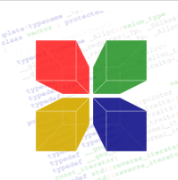

# Hi! I am Eshan Dutta
                  
- 💻 Currently a Computer Science Engineering student and a budding programmer
- 🎮 Probably gaming or coding
- ☕ Caffeine dependent
- 🧩 Feel free to go through all of my projects :)

### I am familiar with: 
        
